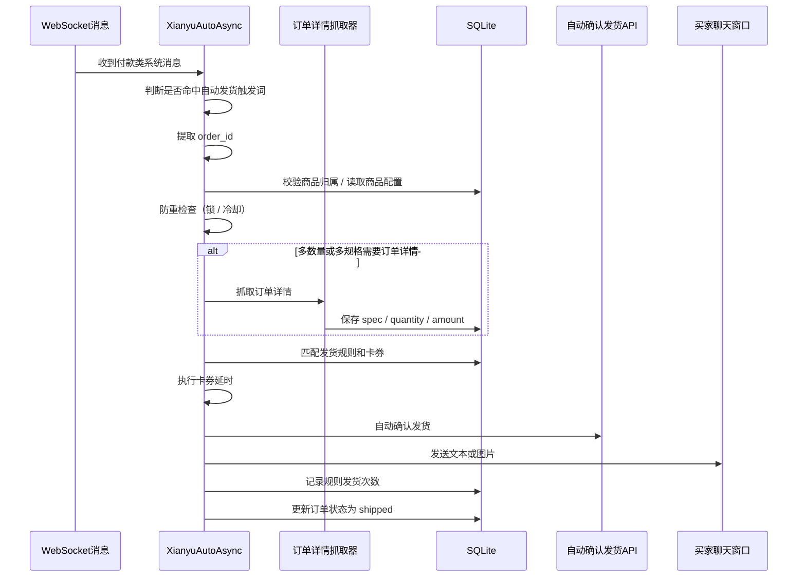

# 自动发货逻辑梳理

## 文档目的

这份文档用于把当前项目里的“自动发货”能力拆成一套容易理解的业务说明，方便：

- 业务侧理解系统在什么时机自动发货
- 开发侧快速定位入口、规则、数据表和关键分支
- 后续做需求变更、排查问题、修复缺陷时快速对齐上下文

本文基于当前仓库实现整理，重点覆盖：

- 自动发货触发链路
- 发货规则匹配逻辑
- 订单状态更新逻辑
- 多规格 / 多数量 / 免拼发货等特殊分支
- 当前实现里已经发现的注意点

---

## 一句话概览

系统通过闲鱼 WebSocket 收到“买家已付款、等待卖家发货”类消息后，进入自动发货入口；随后提取订单 ID，做商品归属校验、防重校验、订单详情补全，并优先检查商品是否已关联卡密资源。

- 如果商品已关联卡密资源：直接按关联资源自动发货，不需要再额外配置发货规则
- 如果商品未关联卡密资源：继续按原有关键词规则匹配卡券发货

最后系统会执行延时处理、自动确认发货、聊天消息发送，并把订单状态回写为已发货。

---

## 业务对象

### 1. 商品 `item_info`

商品表主要承担“商品维度的控制项”和“匹配辅助信息”。

关键字段：

- `cookie_id`: 商品属于哪个账号
- `item_id`: 商品 ID
- `item_title`: 商品标题
- `item_detail`: 商品详情
- `is_multi_spec`: 是否按多规格商品处理
- `multi_quantity_delivery`: 是否按订单数量多发

业务含义：

- 商品是否开启“多规格”，决定发货时是否必须先获取订单规格信息
- 商品是否开启“多数量发货”，决定是否按订单中的 `quantity` 循环发货
- 商品标题和详情会被拼成 `search_text`，用于匹配发货规则

### 2. 卡券 `cards`

卡券是“发什么”的核心载体。

支持的类型：

- `text`: 固定文字
- `data`: 批量数据，一次消费一行
- `api`: 调外部接口动态生成内容
- `image`: 图片发货

关键字段：

- `type`
- `text_content`
- `data_content`
- `api_config`
- `image_url`
- `delay_seconds`: 发货前延时
- `description`: 备注，可拼接到发货内容
- `is_multi_spec`
- `spec_name`
- `spec_value`

### 3. 发货规则 `delivery_rules`

发货规则本质上是“如何从商品命中卡券”的映射。

关键字段：

- `keyword`: 触发关键词
- `card_id`: 对应卡券
- `enabled`
- `delivery_times`: 已发次数统计
- `delivery_count`: 表里有这个字段，但当前运行时基本没有实际参与发货

业务含义：

- 规则负责“匹配哪个卡券”
- 卡券负责“最终发什么”

### 4. 订单 `orders`

订单表保存自动发货链路需要的上下文。

关键字段：

- `order_id`
- `item_id`
- `buyer_id`
- `spec_name`
- `spec_value`
- `quantity`
- `amount`
- `order_status`
- `is_bargain`

业务含义：

- 多规格发货依赖 `spec_name/spec_value`
- 多数量发货依赖 `quantity`
- 自动确认发货和发货完成后会推动 `order_status`
- “我已小刀，待刀成”会把 `is_bargain` 标为 `true`

---

## 关键入口

自动发货的主入口在：

- `XianyuAutoAsync.py`

核心函数：

- `_is_auto_delivery_trigger(message)`
- `_handle_auto_delivery(...)`
- `_auto_delivery(...)`
- `auto_confirm(...)`
- `auto_freeshipping(...)`

订单状态相关入口在：

- `order_status_handler.py`

核心函数：

- `handle_system_message(...)`
- `handle_order_basic_info_status(...)`
- `handle_order_detail_fetched_status(...)`
- `handle_auto_delivery_order_status(...)`

---

## 自动发货触发条件

### 普通自动发货触发词

系统当前主要依赖付款类系统消息触发自动发货，包含：

- `[我已付款，等待你发货]`
- `[已付款，待发货]`
- `我已付款，等待你发货`
- `[记得及时发货]`

触发位置有两类：

- `message["4"].reminderContent`
- 聊天消息里的 `send_message`

这意味着：

- 即使自动回复被“人工接入暂停”，付款类消息仍然会继续走自动发货

### 免拼发货特殊触发

当收到卡片消息，且卡片标题为：

- `我已小刀，待刀成`

系统会先走一遍免拼发货，再继续进入普通自动发货流程。

---

## 主流程时序

---

## 详细流程拆解

### 第 1 步：商品归属校验

在 `_handle_auto_delivery()` 里，系统会先校验 `item_id` 是否属于当前账号。

目的：

- 避免多个账号同时在线时，把别的账号商品错当成当前账号商品处理

如果校验失败：

- 直接跳过自动发货

### 第 2 步：提取订单 ID

系统会从消息结构中提取 `order_id`。

提取方式大致分三层：

1. 从卡片 JSON 里的 `targetUrl` 提取
2. 从 `dynamicOperation` 里的 URL 提取
3. 整体转字符串后用正则兜底搜索

如果没有 `order_id`：

- 直接跳过自动发货

### 第 3 步：防重复控制

系统当前做了多层防重：

- 检查延迟锁是否还在持有
- 检查订单冷却是否命中
- 对同一 `order_id` 使用异步锁串行处理
- 发货成功后给订单加一个 10 分钟延迟释放锁

设计意图：

- 防止同一订单在短时间内被系统消息反复触发
- 防止并发消息导致重复发货

### 第 4 步：多数量发货判断

如果商品开启了 `multi_quantity_delivery`：

- 系统会先抓订单详情
- 从订单详情里取 `quantity`
- 然后循环调用 `_auto_delivery()` 多次

举例：

- 订单数量为 3
- 则会尝试取 3 次发货内容
- 文本会发送 3 条
- 批量数据卡券会消费 3 行

如果没有开启：

- 默认只发 1 次

### 第 5 步：构造规则匹配文本

在 `_auto_delivery()` 中，系统会从数据库读取商品信息：

- `item_title`
- `item_detail`

然后拼出：

- `search_text = 标题 + 详情`

这个 `search_text` 是后续规则匹配的核心输入。

如果数据库里没有详情：

- 系统会尝试自动补拉商品详情

### 第 6 步：多规格判断

如果商品开启了 `is_multi_spec`：

- 系统必须先拿到订单详情中的 `spec_name/spec_value`
- 再按“关键词 + 规格”匹配多规格卡券

如果商品不是多规格：

- 只匹配普通卡券

### 第 7 步：规则匹配

规则匹配的核心原则如下。

#### 普通商品

- 调用 `get_delivery_rules_by_keyword(search_text)`
- 只保留 `is_multi_spec = false` 的卡券

#### 多规格商品

- 调用 `get_delivery_rules_by_keyword_and_spec(search_text, spec_name, spec_value)`
- 然后只保留 `is_multi_spec = true` 的卡券

#### 匹配策略

- 支持“商品文本包含规则关键词”
- 也支持“规则关键词包含商品文本”
- 更长、更精确的关键词优先

#### 唯一性要求

系统要求最终只能命中 1 条规则。

如果命中 0 条：

- 跳过自动发货

如果命中多条：

- 也会直接跳过
- 因为系统不想在不确定时自动发错内容

### 第 8 步：延时发货

匹配到规则后，系统读取的是卡券上的 `delay_seconds`，不是规则上的延时。

含义：

- 延时属于卡券能力
- 同一个关键词绑不同卡券时，延时跟着卡券走

### 第 9 步：自动确认发货

如果有 `order_id`，系统会尝试调用自动确认发货接口。

控制项：

- 每个账号可以配置是否开启自动确认发货
- 同一订单有确认发货冷却时间

特点：

- 即使确认发货失败，也不会阻止后续聊天消息里的发货内容发送

### 第 10 步：生成发货内容

不同卡券类型的处理方式如下。

#### `text`

- 直接取 `text_content`

#### `data`

- 从 `data_content` 中按行消费第一条
- 每发一次就从库存里扣掉一行

#### `api`

- 按 `api_config` 调接口
- 支持动态参数替换
- 可替换参数包括：
  - `order_id`
  - `item_id`
  - `buyer_id`
  - `cookie_id`
  - `spec_name`
  - `spec_value`
  - `order_amount`
  - `order_quantity`

#### `image`

- 返回图片发送标记
- 最终走图片消息发送逻辑
- 本地图片会先上传到闲鱼 CDN

### 第 11 步：备注处理

生成发货内容后，系统会处理卡券备注 `description`。

规则如下：

- 如果备注为空，直接发原始内容
- 如果备注中包含 `{DELIVERY_CONTENT}`，则替换为实际发货内容
- 如果备注中不包含变量，则按“备注 + 空行 + 发货内容”拼接

### 第 12 步：发送给买家

最终发送层仍然走 WebSocket。

文本消息：

- `send_msg()`

图片消息：

- `send_image_msg()`

多数量发货时：

- 每条消息之间默认间隔 1 秒

### 第 13 步：状态与统计回写

成功发货后会做几件事：

- 增加规则的 `delivery_times`
- 发送通知消息
- 调订单状态处理器，把订单状态更新为 `shipped`
- 给当前订单加一个 10 分钟延迟释放锁

---

## 订单状态流转

订单状态统一由 `order_status_handler.py` 管理。

主要状态：

- `processing`: 处理中
- `pending_ship`: 待发货
- `shipped`: 已发货
- `completed`: 已完成
- `refunding`: 退款中
- `refund_cancelled`: 退款撤销
- `cancelled`: 已关闭

常见流转：

1. 收到“我已付款，等待你发货”类消息
2. 系统消息处理器会尝试把状态推到 `pending_ship`
3. 自动发货完成后，状态推到 `shipped`
4. 买家确认收货后，系统消息再把状态推到 `completed`

补充说明：

- 如果自动发货时订单还没写入数据库，状态处理器会把更新放进待处理队列
- 后续订单详情拉取完成后，再补处理这些待更新状态

---

## 特殊分支

### 1. 多数量发货

开关位置：

- 商品维度

行为：

- 根据订单的 `quantity` 循环发货

适用场景：

- 一个订单买了多个虚拟商品
- 需要一单多发

### 2. 多规格发货

开关位置：

- 商品维度决定“是否按规格处理”
- 卡券维度决定“这个卡券属于哪个规格”

行为：

- 先从订单详情里解析出规格
- 再精确匹配对应规格卡券

适用场景：

- 同一商品下有多个套餐、天数、颜色、版本

### 3. 免拼发货

触发条件：

- 收到“我已小刀，待刀成”卡片消息

行为：

- 先调用免拼发货接口
- 再继续走普通自动发货

适用场景：

- 小刀 / 免拼相关交易链路

---

## 前端配置和后端作用分层

### 商品页

负责：

- 开关多规格
- 开关多数量发货

不要把它理解成“商品页配置发货内容”，它更偏向发货行为控制。

### 卡券页

负责：

- 配置发货内容本体
- 配置卡券类型
- 配置延时发货
- 配置备注
- 配置多规格卡券的规格名称和值

### 自动发货规则页

负责：

- 配置“关键词 -> 卡券”的映射

它本身并不决定发货内容细节，主要是路由层。

---

## 开发时建议先看哪里

### 想改“什么时候触发自动发货”

先看：

- `XianyuAutoAsync.py` 里的 `_is_auto_delivery_trigger()`
- WebSocket 消息处理主循环

### 想改“怎么匹配规则”

先看：

- `_auto_delivery()`
- `db_manager.get_delivery_rules_by_keyword()`
- `db_manager.get_delivery_rules_by_keyword_and_spec()`

### 想改“发什么内容”

先看：

- `_auto_delivery()` 里不同 `card_type` 的分支
- `_get_api_card_content()`
- `_process_delivery_content_with_description()`

### 想改“订单状态怎么走”

先看：

- `order_status_handler.py`

### 想改“多买几件时怎么发”

先看：

- 商品表的 `multi_quantity_delivery`
- `_handle_auto_delivery()` 里 `quantity_to_send` 的计算

### 想改“多规格怎么匹配”

先看：

- 商品表的 `is_multi_spec`
- 卡券表的 `is_multi_spec/spec_name/spec_value`
- `_auto_delivery()` 的多规格分支

---

## 当前实现里需要特别注意的点

下面这些是当前代码里已经能看出来的现状，不一定都是线上问题，但开发时要心里有数。

### 1. `delivery_count` 基本未真正参与运行时发货

现状：

- 数据表有 `delivery_count`
- 规则 CRUD 也会读写这个字段
- 但实际自动发货逻辑里没有按它决定发送次数
- 前端规则页现在也已经固定把它传成 `1`

实际生效的“一单多发”机制不是它，而是：

- 商品级 `multi_quantity_delivery`
- 订单级 `quantity`

### 2. 多规格的“普通卡券兜底”与当前实际代码不完全一致

表象上：

- 查询函数里存在普通卡券兜底 SQL
- 卡券页文案也写了“找不到时使用普通卡券兜底”

但当前主流程里：

- 多规格分支在拿到查询结果后，又过滤成“只保留多规格卡券”

这意味着当前实际行为更接近：

- 多规格商品没有匹配到精确多规格卡券时，直接跳过发货
- 不会真正落到普通卡券兜底

### 3. 防重复设计里有一部分变量目前没有完全落到实际判断闭环

现状：

- `last_delivery_time` 被用于检查和清理
- 但当前代码里没有看到发货成功后写回它的地方
- `delivery_sent_orders` 有 `add`，但当前主流程没有看到它参与实际拦截判断

因此当前真正稳定生效的防重复更依赖：

- 每订单异步锁
- 10 分钟延迟释放锁

### 4. `send_delivery_failure_notification()` 名字会让人误解

虽然函数名叫“失败通知”，但当前成功和失败都会调用它。

它更准确的业务语义其实是：

- 自动发货结果通知

### 5. 自动确认发货失败不会阻断聊天内容发货

这是当前实现刻意保留的行为。

含义：

- “确认发货”与“给买家发内容”是两个相对独立的动作
- 前者失败，不代表后者不继续

业务上是否符合预期，需要后续根据实际运营要求确认。

---

## 调试和排查建议

如果后续遇到“为什么没发出去”，建议按下面顺序排查。

### 1. 先看是否触发入口

确认：

- 收到的是否是付款类系统消息
- 是否命中了自动发货触发词

### 2. 再看是否拿到 `order_id`

确认：

- 消息结构是否变了
- 提取正则是否还能命中

### 3. 再看商品归属是否通过

确认：

- 当前 `item_id` 是否属于当前账号

### 4. 再看商品配置

确认：

- 是否错误开启了多规格
- 是否错误开启了多数量发货

### 5. 再看规则匹配

确认：

- 商品标题和详情拼出来的 `search_text` 是什么
- 是否唯一命中规则
- 是否因为命中多条规则而被系统跳过

### 6. 再看卡券内容本身

确认：

- `text` 是否为空
- `data` 是否还有库存
- `api` 是否调用成功
- `image_url` 是否有效

### 7. 再看确认发货和消息发送

确认：

- 自动确认发货接口是否成功
- WebSocket 发消息是否成功
- 图片是否上传到 CDN 成功

---

## 关键文件索引

### 主流程

- `XianyuAutoAsync.py`

### 订单状态处理

- `order_status_handler.py`

### 数据库访问

- `db_manager.py`

### 自动确认发货

- `secure_confirm_decrypted.py`

### 免拼发货

- `secure_freeshipping_decrypted.py`

### 订单详情抓取

- `utils/order_detail_fetcher.py`

### 发货规则前端

- `frontend/src/pages/delivery/Delivery.tsx`

### 卡券管理前端

- `frontend/src/pages/cards/Cards.tsx`

### 商品管理前端

- `frontend/src/pages/items/Items.tsx`

---

## 给后续开发的建议

如果后面要继续迭代自动发货，建议优先做这几件事：

1. 明确 `delivery_count` 是否彻底废弃，还是恢复为真实生效字段。
2. 明确多规格商品到底要不要“普通卡券兜底”，然后统一代码和前端文案。
3. 把防重复逻辑收敛成一套真正闭环的机制，避免“设计有三层、实际只生效一层半”。
4. 把“自动发货结果通知”函数改个更准确的命名，减少误解。
5. 如果后续需求会继续变复杂，可以考虑把“触发、匹配、确认、发送、回写”拆成更独立的服务层。

---

## 小结

当前自动发货逻辑的核心可以概括为：

- 付款消息触发
- 订单 ID 提取
- 商品配置判断
- 规则唯一匹配
- 卡券内容生成
- 自动确认发货
- 聊天消息发货
- 订单状态回写

整体链路已经比较完整，但“规则数量字段未实际生效”、“多规格兜底行为不一致”、“部分防重复变量未闭环”这几个点，在后续开发时需要特别留意。
